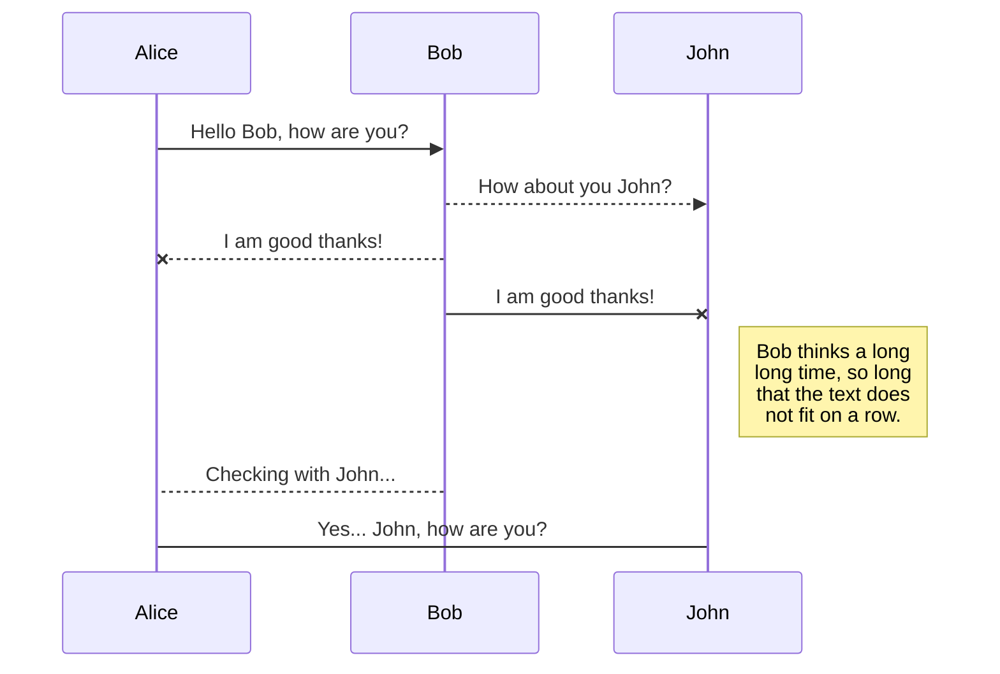
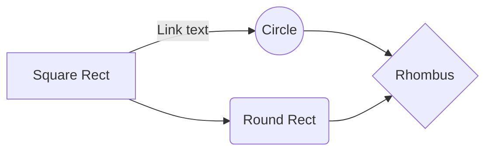

# Overview

### Hi there, My name is Hou and I am currently transitioning to Web development.  

[![Portfolio Website]](https://hou-portfolio.netlify.app/)
[![LinkedIn]](https://www.linkedin.com/in/houchong-chan/)
[![Instagram Follow]](https://www.instagram.com/inksults2inkjuries/)

> Hello

## 👯 I'm a Developer and an Artist 

- 🌱 As a developer. I am prioritizing Next.js, MySQL, and Typescript 🤣
- ✒️ I love to draw and learn new languages 

### Connect with me:

[][linkedin]
[][instagram]

 

### Languages and Tools:

[][webdevplaylist]
[][webdevplaylist]
[][cssplaylist]
[][cssplaylist]
[][jsplaylist]
[][reactplaylist]
[][webdevplaylist]
[][webdevplaylist]
[][webdevplaylist]
[][webdevplaylist]
[][webdevplaylist]
[][webdevplaylist]
[][webdevplaylist]
[][webdevplaylist]
 

---

[website]: url here
[instagram]: https://www.linkedin.com/in/houchong-chan/
[linkedin]: https://www.instagram.com/inksults2inkjuries/

