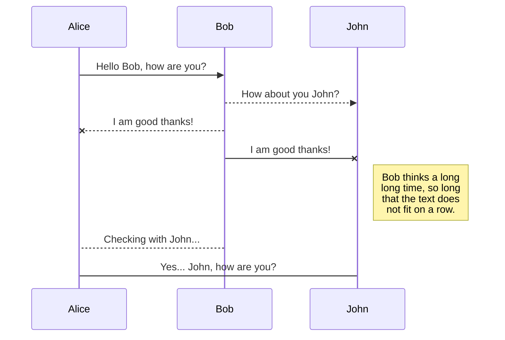
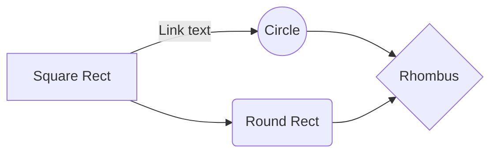

# Overview

### Hi there, I'm __. Currently transitioning to Web development.  

[![Instagram Follow]](https://www.instagram.com/inksults2inkjuries/)

> Hello

## I'm a Developer and an Artist 

- 🌱 I’m currently learning **everything** 🤣
- 👯 I’m looking to collaborate with other content creators
- 🥅 2021 Goals: Contribute more to Open Source projects
- ⚡ Fun fact: I love to draw and learn new languages 

### Connect with me:

[][linkedin]
[][instagram]

 

### Languages and Tools:

[][webdevplaylist]
[][webdevplaylist]
[][cssplaylist]
[][cssplaylist]
[][jsplaylist]
[][reactplaylist]
[][webdevplaylist]
[][webdevplaylist]
[][webdevplaylist]
[][webdevplaylist]
[][webdevplaylist]
[][webdevplaylist]
[][webdevplaylist]
[][webdevplaylist]
 

---

### 📕 Latest Blog Posts

<!-- BLOG-POST-LIST:START -->
- [Add first blog post here](url)
<!-- BLOG-POST-LIST:END -->

➡️ [Add homepage here](url )

---

  
:zap: Recent GitHub Activity

  
<!--START_SECTION:activity-->
1. 🗣 Commited this file[#1](url) in [displayed linke](url)

<!--END_SECTION:activity-->

  
:zap: GitHub Stats

  

[website]: url here
[instagram]: https://instagram.com/codeSTACKr
[linkedin]: https://linkedin.com/in/codeSTACKr

## SmartyPants

SmartyPants converts ASCII punctuation characters into "smart" typographic punctuation HTML entities. For example:

|                |ASCII                          |HTML                         |
|----------------|-------------------------------|-----------------------------|
|Single backticks|`'Isn't this fun?'`            |'Isn't this fun?'            |
|Quotes          |`"Isn't this fun?"`            |"Isn't this fun?"            |
|Dashes          |`-- is en-dash, --- is em-dash`|-- is en-dash, --- is em-dash|

## KaTeX

You can render LaTeX mathematical expressions using [KaTeX](https://khan.github.io/KaTeX/):

The *Gamma function* satisfying $\Gamma(n) = (n-1)!\quad\forall n\in\mathbb N$ is via the Euler integral

$$
\Gamma(z) = \int_0^\infty t^{z-1}e^{-t}dt\,.
$$

> You can find more information about **LaTeX** mathematical expressions [here](http://meta.math.stackexchange.com/questions/5020/mathjax-basic-tutorial-and-quick-reference).

[Mermaid](https://mermaidjs.github.io/)

